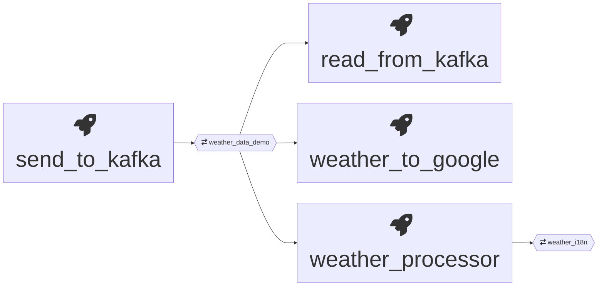

```mermaid
%%{ init: { 'flowchart': { 'curve': 'monotoneX' } } }%%

graph LR;
send_to_kafka[fa:fa-rocket send_to_kafka] -->weather_data_demo{{ fa:fa-arrow-right-arrow-left weather_data_demo }}:::topic ;

weather_data_demo -->read_from_kafka[fa:fa-rocket read_from_kafka];
weather_data_demo -->weather_to_google[fa:fa-rocket weather_to_google];
weather_data_demo -->weather_processor[fa:fa-rocket weather_processor];

weather_processor[fa:fa-rocket weather_processor] --> weather_i18n{{ fa:fa-arrow-right-arrow-left weather_i18n }}:::topic ;

classDef default font-size:150%;
classDef topic font-size:100%;
```
